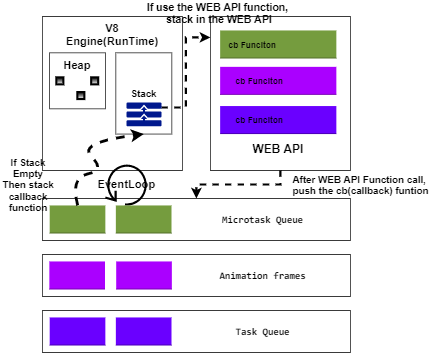

# JS Engine
- [JS Engine](#js-engine)
  - [Compile & RunTime Engine](#compile--runtime-engine)
  - [V8 Engine](#v8-engine)
  - [Single Thread & EventLoop, Queue](#single-thread--eventloop-queue)
  - [Hidden Class & Inline Cache (V8 Engine)](#hidden-class--inline-cache-v8-engine)
  - [Optimised JavaSript Code](#optimised-javasript-code)
  - [Reference](#reference)

## Compile & RunTime Engine

- 다양한 웹브라우저(Chrome, Edge, ...) 혹은 Node같이 `JS를 실행 시키기 위한(compile & runTime)` 다양한 **엔진을** 지원한다.

  - JS Engine
    - 자바스크립트 코드를 실행하는 프로그램 혹은 인터프리터를 말한다.(No Compiler)
    - 표준적인 인터프리터로 구현될 수도 있고 혹은 자바스크립트 코드를 바이트코드로 컴파일하는 JIT(Just-In-Time) 컴파일러로 구현할 수도 있다.

  - V8 Engine
    - 자바스크립트 대표적인 엔진은 C++로 구현된 V8 엔진을 볼 수 있다.
    - 속도 향상을 위해 V8은 인터프리터를 사용하는 대신 JS 코드를 더 효율적인 머신 코드로 번역한다. (하지만, **중간코드를 생산하지 않는다.**)
    - 멀티 스레드로 컴파일 실행(main thread), 컴파일, 프로파일러, GC Sweep 등이 있다.

## V8 Engine

- Stack
    - 실행 가능한 함수들을(stack Frame) 순차적으로 실행하는 공간
    - JS는 싱글 쓰레드 프로그래밍 언어
      - 콜스택이 하 나 
      - 따라서 한 번에 하나의 일만 할 수 있다.
- Heap
  - 동적으로 생성된 인스턴스(객체)를 관리하는 영역

## Single Thread & EventLoop, Queue

- JS는 싱글 스레드이기 때문에 실행 가능한 코드의 지연이 오래 걸릴 수 록 UI Render 문제 혹은 프로그램이 다운이 될 수 있다.
  - 그래서 대부분 브라우저는 Web API를 구현하여 비동기적 실행을 가능하게 구현이 되어있다.
  - **V8 Engine의 속해있지 않은 외부에서(브라우저) 구현된 구조이다.**

- Queue
  - Microtask Queue (1순위 stack 반영) (ex. then(...) func. of promise func. )
  - Animation frames (2순위 stack 반영) (ex. UI render or repaint)
  - Task Queue (3순위 stack 반영)

  - Web API에서 실행 완료후 CallBack 함수를 Queue에 push 한다.
    - 호출된 함수의 특성을 통해 Microtask, Animation, Task를 보낸다.

- EventLoop
  - EventLoop는 JS Engine의 call Stack이 비어있으면 eventLoop가 queue를 확인하여 call stack에 보낸다.
  ```js
    while(queue.waitForMessage()){
      queue.processNextMessage();
    }
  ```
    - queue.waitForMessage() 함수는 현재 아무 메시지도 없다면 새로운 메시지 도착을 **동기적으로 기다린다.**
  - EventLoop에 대해 개념을 잡을 수 있는 유명한 영상이 있다. [What the heck is event loop? | Philip Roberts | JSConf EU](https://youtu.be/8aGhZQkoFbQ)

  

## Hidden Class & Inline Cache (V8 Engine)

- 대부분의 JavaScript 인터프리터가 딕셔너리와 유사한 구조(해쉬함수 기반)를 이용해 **객체 속성 값의 위치를 메모리에 저장한다.**
  - 하지만, 이럴경우 객체의 속성 값을 찾는데 비용이 많이 든다. 

- JAVA에서는 모든 객체 속성이 `컴파일 전에` **고정된 객체 레이아웃에 의해 결정되고** **런타임에 동적으로 추가되거나 제거될 수 없다.**
  - 따라서 속성값(혹은 이들 속성을 가리키는 포인터)은 메모리에 고정된 `오프셋을` 가진 **연속적인 버퍼로 저장될 수 있고** `오프셋의 길이는` **속성 타입에 따라 쉽게 결정될 수 있다.**

- V8 Engine의 `Hidden Class는` JAVA와 같은 언어에서 사용되는 고정 객체 레이아웃과 유사하게 작동하는데 **다만 `런타임에` 생성된다는 차이점이 있다.**
  - 객체가 생성될 때 하나의 `Hidden Class가` 생성되고 프로퍼티 값을 부여 될 때 마다 해당 프로퍼티의 `오프셋을 담은 Hidden Class가 생성되어` 객체가 가리키는 Hidden Class 포인터를 업데이트 한다.
  - 이전 Hidden Class에는 새로 업데이트한 Hidden Class를 연결한다.
  - 마지막으로 업데이트한 Hidden Class에는 연결된 Hidden Class를 통해 offset 정보를 쉽게 찾을 수 있다. 
  - 하지만, 히든클래스 전환은 프로퍼티가 객체에 추가되는 순서에 의존적이다.
    - 프로퍼티 할당 순서를 바꾸게 된다면 다른 Hidden Class를 생성하므로 최적화 코드가 다르게 된다.
    - 여기서 `Inline Cache는` 함수에 부여된 파라미터의 객체 참조 Hidden Class 정보를 기억하는데 만약 같은 객체의 다른 Hidden Class를 공유하게 된다면 Inline Cache를 할 수 없어 실행 속도는 하나의 히든클래스와 공유한 코드보다 느리게 된다.


## Optimised JavaSript Code

1. 객체 속성의 순서
    - 객체 속성을 항상 같은 순서로 초기화해서 히든클래스 및 이후에 생성되는 최적화 코드가 공유될 수 있도록 한다.
  
2. 동적 속성
    - 객체 생성 이후에 속성을 추가하는 것은 히든 클래스가 변하도록 강제하고 이전의 히든클래스를 대상으로 최적화되었던 모든 메소드를 느리게 만든다.
    - 모든 객체의 속성을 생성자에서 할당하는것을 추천한다.
  
3. 메소드
    - 동일한 메소드를 반복적으로 수행하는 코드가 서로 다른 메소드를 한 번씩만 수행하는 코드 보다 더 빠르게 동작한다. (인라인 캐싱 때문)

4. 배열
     Array 또한 객체로 구성된 배열이다. 즉 메모리에 연속된 주소 참조가 아닐 수 있다. (해시테이블)
     Array 객체는 희소배열이기 때문에 delete로 프로퍼티를 삭제할 수 있다.
    - 하지만 프로퍼티를 삭제하지 않는게 좋다.
    - index 순서가 일정하지 않은 배열은 접근하기에 많은 비용이 든다.
     또한 커다란 배열을 미리 할당하지 않도록 한다.
    - 사용하면서 크기가 커지도록 하는 게 낫다. 

5. 태깅된 값
    - V8은 객체와 숫자를 32비트로 표현한다.
    - 어떤 값이 오브젝트(flag = 1)인지 혹은 정수(flag = 0)인지는 SMI(Small Integer)라는 하나의 비트에 저장하고 이 때문에 31비트가 남는다. 
    - 따라서 어떤 숫자가 31비트 보다 크면 V8은 이 숫자를 분리해서 더블 타입으로 전환한 다음 이 숫자를 넣을 새로운 객체를 생성한다. 
    - 이러한 동작은 비용이 높으므로 가능한한 31비트의 숫자를 사용하도록 하는게 좋다.

## Reference

- [V8 엔진 구성](https://engineering.huiseoul.com/%EC%9E%90%EB%B0%94%EC%8A%A4%ED%81%AC%EB%A6%BD%ED%8A%B8%EB%8A%94-%EC%96%B4%EB%96%BB%EA%B2%8C-%EC%9E%91%EB%8F%99%ED%95%98%EB%8A%94%EA%B0%80-%EC%97%94%EC%A7%84-%EB%9F%B0%ED%83%80%EC%9E%84-%EC%BD%9C%EC%8A%A4%ED%83%9D-%EA%B0%9C%EA%B4%80-ea47917c8442)
- [V8 엔진 내부](https://engineering.huiseoul.com/%EC%9E%90%EB%B0%94%EC%8A%A4%ED%81%AC%EB%A6%BD%ED%8A%B8%EB%8A%94-%EC%96%B4%EB%96%BB%EA%B2%8C-%EC%9E%91%EB%8F%99%ED%95%98%EB%8A%94%EA%B0%80-v8-%EC%97%94%EC%A7%84%EC%9D%98-%EB%82%B4%EB%B6%80-%EC%B5%9C%EC%A0%81%ED%99%94%EB%90%9C-%EC%BD%94%EB%93%9C%EB%A5%BC-%EC%9E%91%EC%84%B1%EC%9D%84-%EC%9C%84%ED%95%9C-%EB%8B%A4%EC%84%AF-%EA%B0%80%EC%A7%80-%ED%8C%81-6c6f9832c1d9)
- [JBee: JS EventLoop](https://asfirstalways.tistory.com/362)
- [JS Web API, Queue 우선순위 처리 과정](http://sculove.github.io/blog/2018/01/18/javascriptflow/)
- [MDN: JS EventLoop](https://developer.mozilla.org/ko/docs/Web/JavaScript/EventLoop)
- [자바스크립트와 이벤트 루프](https://meetup.toast.com/posts/89)
- [자바스크립트 개발자라면 알아야 할 33가지 개념 #1 콜스택 (번역)](https://velog.io/@jakeseo_me/2019-03-15-2303-%EC%9E%91%EC%84%B1%EB%90%A8-rmjta5a3xh)
- [자바스크립트 개발자라면 알아야 할 33가지 개념 #11 V8 엔진이 JS를 기계 코드로 바꾸는 방법](https://velog.io/@jakeseo_me/2019-04-30-1204-%EC%9E%91%EC%84%B1%EB%90%A8-fxjv37gc4s)
- [YouTube: What the heck is event loop? | Philip Roberts | JSConf EU](https://youtu.be/8aGhZQkoFbQ)