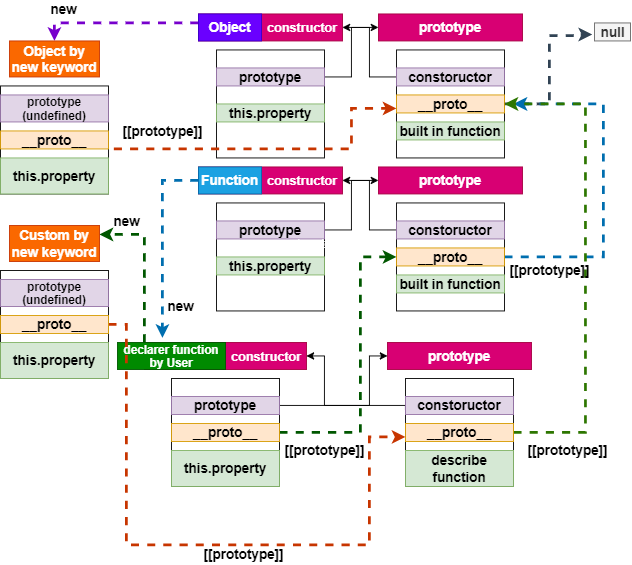
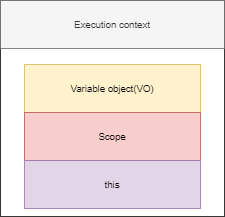
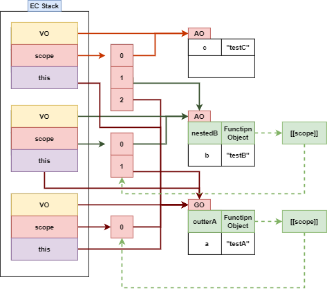

# JS Function

- [JS Function](#js-function)
  - [함수의 정의](#함수의-정의)
  - [함수 선언 vs 함수 표현식](#함수-선언-vs-함수-표현식)
    - [호이스팅](#호이스팅)
  - [Function 인자 가변 길이 인수(Arguments 객체)](#function-인자-가변-길이-인수arguments-객체)
  - [\[\[Prototype\]\] 접근자 \_\_proto\_\_ 프로퍼티](#prototype-접근자-__proto__-프로퍼티)
  - [prototype 객체 변경](#prototype-객체-변경)
  - [prototype에 프로퍼티 할당과 호출](#prototype에-프로퍼티-할당과-호출)
  - [실행 컨텍스트(Excution Context)](#실행-컨텍스트excution-context)
    - [실행 컨텍스트(EC) 프로퍼티](#실행-컨텍스트ec-프로퍼티)
    - [실행 컨텍스트 실행(처리) 순서](#실행-컨텍스트-실행처리-순서)
    - [Ex. 실행 가능한 함수 [code]](#ex-실행-가능한-함수-code)
    - [Ex. 중첩함수 리턴](#ex-중첩함수-리턴)
  - [함수 프로토타입 함수추가 (데코레이터)](#함수-프로토타입-함수추가-데코레이터)
  - [Reference](#reference)

## 함수의 정의

```js
function hello(x, y) {
  return x * y;
} // 함수의 정의(함수 선언)

var hello = function (x, y) {
  return x * y;
}; // 리터럴(anonymous function) (함수 표현식)

var hello = new Function("x,y", "return x*y"); // Function 생성자(new 연산자)

var hello = (x, y) => x * y; // 화살표 함수
```

## 함수 선언 vs 함수 표현식

- 함수 선언도 함수의 표현식과 같은 형태로 저장하는 방식이 같다.
- 함수명과 함수 참조값을 가진 변수명이 일치하므로 함수명으로 호출되는 듯 보이지만 **사실은 변수명으로 호출된 것이다.**
- 결국 함수 선언도 함수 표현식과 동일하게 **함수 리터럴 방식으로 정의되는 것이다.**

  ```js
  function hello(x, y) {
    return x * y;
  } // 함수의 정의(함수 선언)

  // INNER CORER
  var hello = function hello(x, y) {
    return x * y;
  }; // 함수의 정의(함수 표현식 => 변수 선언)
  ```

- 함수 표현식에서 함수이름을 정할 수도 있다. 하지만, 해당 함수 이름으로 호출 할 수 없다. **단지 디버깅시 해당 함수를 쉽게 알기 위함.**
  ```js
  var hello = function world(x, y) {
    return x * y;
  }; // 리터럴(함수 표현식)
  world(2, 3); // Error
  ```

### 호이스팅

- ES6의 let, const를 포함하여 모든 선언(var, let, const, function, function\*, class)을 호이스팅(Hoisting)한다.
- `호이스팅이란` var 선언문이나 function 선언문 등 모든 선언문이 해당 `Scope의 선두로` 옮겨 동작하는 특성을 말한다.

  - 즉, 모든 선언, 할당되기 이전에 참조 가능하다.

- 여기서 `함수 선언으로` 작업할 경우, **함수 호이스팅이 발생된다.**

  - 함수 호이스팅경우 **해당 함수의 객체를 생성하여(VO)** Reference Type으로 해당 **함수 선언에 연결을 한다.**
  - 함수 호이스팅으로 선언 이전에 함수를 호출 할 수 있다.

  ```js
  console.log(hello(2, 3)); // 6
  function hello(x, y) {
    return x * y;
  }
  ```

- 함수 선언의 경우와는 달리 `함수 표현식의 경우` 함수 호이스팅이 아니라 **변수 호이스팅이 발생한다.**

  - 변수 호이스팅경우 선언문의 이름을 **Scope의 선두로 올리고 값을 `undefined로` 부여한다.**
  - 즉, 함수의 객체가 생성되지 않았기 때문에 **해당 변수를 함수로 보지않는다.**

  ```js
  var hello = world(5); // Error

  var world = function (x, y) {
    return x * y;
  };
  ```

## Function 인자 가변 길이 인수(Arguments 객체)

- **Arguments** 객체는 프로퍼티로 `length`와 `callee`를 갖고 있다.
  - 해당 **Function 객체에서는** `arguments 프로퍼티` 부여
  - **유사 배열 객체**
  - length: 인수 개수
  - callee: 현재 실행되고 있는 함수 참조
- Argumetns 객체는 인수 목록과 연동되어 **arguments 값을 바꾸면 인수도 바뀐다.**
  ```js
  (function (x, y) {
    arguments[0] = 55;
    console.log(x, y); // 55, 2
  })(2, 2);
  ```

## \[\[Prototype\]\] 접근자 \_\_proto\_\_ 프로퍼티

- `모든 객체는` \[\[Prototype\]\]이라는 내부 슬롯이 있다.
- \[\[Prototype\]\] 내부 슬롯은 **Prototype 객체를 가리킨다.**
  - 프로토타입 객체란 프로토타입 기반으로 **상속을 구현하기 위해 사용된다.**
  - 내부 슬롯을 직접 접근을 못하므로 **`__proto__ 접근자 프로퍼티로` 접근을 한다.**
- 즉, 프로토타입 객체는 다른 객체에 공유 프로퍼티를 제공하는 객체를 말한다.
- **prototype 프로퍼티는 함수 객체만이 소유하는 프로퍼티이다.** (일반 객체에는 prototype 프로퍼티가 없다.)

  - 만약 new Object()로 할경우 Object는 생성자 함수로 구현되어있기 때문에 Object.\_\_proto\_\_ === Fucntion.prototype 을 가리키게 된다.
  - Object로 생성된 인스턴스는 Object.prototype을 가리키게 된다.({}.\_\_proto\_\_ === Object.prototype)

  

- 여기서 `declare function by User(F)`의 \_\_proto\_\_가 아닌 `prototype은` new F를 호출해 새롭게 만든 객체의 [[Prototype]]을 할당해 주기 위함이다.

## prototype 객체 변경

- `prototype`도 **객체이다.**
- prototype 객체는 **다른 임의의 객체로 변경할 수 있다.** (객체의 상속)
- 프로토타입 객체를 변경하는 시점에 따라 생성된 인스턴스(객체)의 prototype이 가리키는 참조값이 달라진다.

```js
function Hello(next) {
  this.next = next;
}

var hi = new Hello("World");

// 프로토타입 객체의 변경
Hello.prototype = { what: "JavaScript" }; // Object로 생성된 객체 Reference 참조

var hey = new Hello("World!!!!");

console.log(hi.what); // undefined
console.log(hey.what); // 'JavaScript'

console.log(hi.constructor); // Hello(next)
console.log(hey.constructor); // Object()
```

- 프로토타입 객체 변경 후, Hello() 생성자 함수의 Prototype 프로퍼티가 가리키는 프로토타입 객체를 Object 객체로 변경하면서 Hello.prototype.constructor 프로퍼티도 삭제되었다.
- hey.constructor의 값은 프로토타입 체이닝에 의해 Object 생성자 함수가 된다.

## prototype에 프로퍼티 할당과 호출

```js
let hamster = {
  stomach: [],

  eat(food) {
    this.stomach.push(food);
  },
};

let speedy = {
  __proto__: hamster,
};

let lazy = {
  __proto__: hamster,
};
```

- 상속된 prototype의 함수를 호출할 때, 함수안에 this.[key] 에따라 상속 받은 객체와 부모 객체 상태가 달라진다.

  - this.[key] : 프로퍼티 할당
  - this.[key][function] : 함수 호출

- 이 때는 `this.stomach.push`를 `호출했기` 때문에 hamster 객체에 `stomach가` 푸쉬된다.
- `this.stomach`로 교체한다면 상속하고 있는 객체 `할당된다`.

## 실행 컨텍스트(Excution Context)

- 실행 가능한 코드(Executable Code)를 만나면 그 코드를 평가(Evaluation)하여 실행 문맥(EC)을 만든다.

  - **전역 코드**
  - **함수 코드**
  - eval 코드
    - eval 코드는 lexical Environment가 아닌 동적 환경에 실행 된다.

- JS 엔진은 코드를 실행하기 위해 실행에 필요한 정보들을 알고 있어야 한다.
  - **변수** (전역변수, 지역변수, 매개변수, 객체의 프로퍼티)
  - **함수 선언**
  - **변수의 유효범위(Scope)**
  - **this**

### 실행 컨텍스트(EC) 프로퍼티

- 

- Variable Object(VO)

  - value, parameter, arguments, 함수 선언
  - `실행 컨텍스트에 따라` **가리키는 객체가 달라진다.**

    - `Global Enviroment Context`

      - 전역 코드 즉, 매개변수가 없는 전역코드를 평가하는 시점에서, VO는 전역객체(Global Object /GO)를 가리킨다.
      - 초기 상태의 전역객체는 빌트인 객체와 BOM, DOM이 구현이되어 있다. (구현이 된 후 전역 실행 컨텍스트가 생성)
      - 전역 객체는 전역에 선언된 전역 변수와 전역 함수를 프로퍼티로 소유한다.

    - `Funciton Context`
      - VO는 활성 객체(Activation Object /AO)를 가리키며 매개변수와 인수들의 정보를 배열의 형태로 담고 있는 객체인 arguments object가 추가 된다.

- Scope
  - 스코프는 `식별자를 검색하는 매커니즘이다.`
  - [Variable Object + All parent(VO)]
    - 리스트 형식으로 현재 실행 컨텍스트의 활성 객체를 선두로 시작하여 상위 컨텍스트의 활성 객체를 가리키며 마지막으로 GO를 가리킨다.
  - 함수 프로퍼티인 `[[Scope]]`로 참조한다.
- this
  - context object : 함수를 실행시킨 객체, 전역 코드는 window(브라우저)로 부여한다.

### 실행 컨텍스트 실행(처리) 순서

1. 스코프 체인의 생성과 초기화
2. Variable Instantiation(변수 객체화) 실행

   - Variable Instantiation은 Variable Object에 프로퍼티와 값을 추가하는 것을 의미한다.

   - 프로퍼티 값 설정 순서

     1. (`Function Code인 경우)` `매개변수(parameter)가` Variable Object의 프로퍼티 `name`으로, `인수(argument)가` `value`로 설정된다.
     2. 대상 코드 내의 `함수 선언`(함수 표현식 제외)을 대상으로 `함수명이` Variable Object의 `name`으로, 생성된 `함수 객체가` `value`로 설정된다. **(함수 호이스팅)**
     3. 대상 코드 내의 `변수 선언을` 대상으로` 변수명이` Variable Object의 `name`으로, `undefined가` `value`로 설정된다. (변수 호이스팅)

   - 변수(프로퍼티) 선언 처리
     1. 선언 단계(Declaration phase)
        - 변수 객체(Variable Object)에 변수를 등록한다. 이 변수 객체는 스코프가 참조할 수 있는 대상이 된다.
     2. 초기화 단계(Initialization phase)
        - 변수 객체(Variable Object)에 등록된 변수를 메모리에 할당한다. 이 단계에서 변수는 `undefined로` 초기화된다.
     3. 할당 단계(Assignment phase)
        - `EC가 구성된 후` 전체 코드를 순차적으로 실행될 때 시점이다.
        - `undefined로` 초기화된 변수에 실제값을 할당한다.

3. this value 결정

### Ex. 실행 가능한 함수 [code]

```js
var a = "testA";

function outterA() {
  var b = "testB";

  function nestedB() {
    var c = "testC";
    console.log(a, b, c);
  }
  nestedB();
}

outterA();
```



### Ex. 중첩함수 리턴

```js
function makeCounter() {
  let count = 0;

  return function () {
    return count++;
  };
}

let counter = makeCounter();
```

> 모든 함수는 함수가 생성된 곳의 렉시컬 환경을 기억한다는 점입니다.
> 함수는 [[Environment]]라 불리는 숨김 프로퍼티를 갖는데, 여기에 함수가 만들어진 곳의 렉시컬 환경에 대한 참조가 저장됩니다.

> counter.[[Environment]]엔 {count: 0}이 있는 렉시컬 환경에 대한 참조가 저장됩니다.
> **호출 장소와 상관없이 함수가 자신이 태어난 곳을 기억할 수 있는 건 바로** [[Environment]] 프로퍼티 덕분입니다.
>
> [[Environment]]는 함수가 생성될 때 딱 한 번 그 값이 세팅됩니다. 그리고 이 값은 영원히 변하지 않습니다.
>
> counter()를 호출하면 각 호출마다 새로운 렉시컬 환경이 만들어집니다.
>
> 그리고 이 렉시컬 환경은 counter.[[Environment]]에 저장된 렉시컬 환경을 외부 렉시컬 환경으로서 참조하게 됩니다.

> new Function을 이용해 만든 함수의 [[Environment]]는 외부 렉시컬 환경이 아닌 전역 렉시컬 환경을 참조하므로 외부 변수를 사용할 수 없습니다.
>
> 단점 같아 보이는 특징이긴 하지만 에러를 예방해 준다는 관점에선 장점이 되기도 합니다.
>
> 구조상으론 매개변수를 사용해 값을 받는 게 더 낫습니다. 압축기에 의한 에러도 방지할 수 있죠.

## 함수 프로토타입 함수추가 (데코레이터)

- `데코레이터는` 함수를 감싸는 래퍼로 함수의 행동을 변화시킨다.
- 주요 작업은 여전히 함수에서 처리한다.

```js
Function.prototype.defer = function (ms) {
  let f = this; // 호출한 인스턴스 함수 // ex. sayHi (함수도 Function객체의 인스턴스 이다.)
  return function (...args) {
    setTimeout(() => f.apply(this, args), ms);
  };
};

let user = {
  name: "John",
  sayHi() {
    alert(this.name);
  },
};

user.sayHi = user.sayHi.defer(1000);

user.sayHi();
```

## Reference

- [변수의 유효범위와 클로져](https://ko.javascript.info/closure#ref-704)
- [객체로서의 함수와 기명 함수 표현식](https://ko.javascript.info/function-object?map)
- ['new Function' 문법](https://ko.javascript.info/new-function)
- [call/apply와 데코레이터, 포워딩](https://ko.javascript.info/call-apply-decorators)
- [프로토타입 상속](https://ko.javascript.info/prototype-inheritance)
- [함수의 prototype 프로퍼티](https://ko.javascript.info/function-prototype)
- [프로토타입 메서드와 \_\_proto\_\_가 없는 객체](https://ko.javascript.info/prototype-methods)
